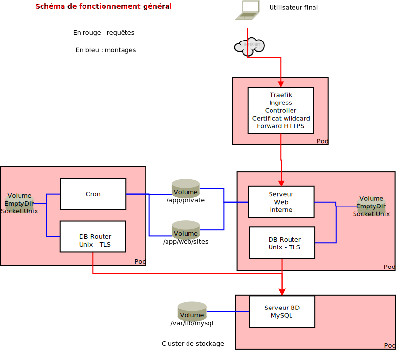

# Kubernetes : maquettage

Kubernetes est l'environnement cible pour les environnements Civiparoisse. En effet, Kubernetes permet de gérer un cluster de machines pour pouvoir exécuter des conteneurs sur le cluster.

Il va y avoir en fait deux clusters :

* un cluster que l'on pourrait assimiler à un cluster de calcul, qui va disposer des ressources matérielles pour exécuter les charge
* un cluster de stockage

Les deux clusters doivent être interconnectés avec des ressources réseau adéquates.

Le travail principal avec Kubernetes consiste à définir de manière déclarative, via des fichiers appelés manifestes, écrits en JSON ou YAML, des ressources qui vont servir à configurer des charges de travail à exécuter.


## Minikube

En pratique, l'environnement utilisé pour le développement est Minikube, qui est un environnement Kubernetes packagé, prévu pour apprendre. Avec Minikube, on est limité à un cluster Kubernetes à un seul noeud, mais on dispose d'une émulation simple d'un système de stockage persistant qui va stocker les données sur le disque dur du système (default-storageclass et storage-provisionner).

*** Remarque sur le storage-provisionner : ce provisionneur est un provisionneur très simple, qui va utiliser l'espace dans /var/hostpath-provisionner du container Docker de Minikube. Cet espace est géré à l'aide du namespace et du nom de claim. Lorsque le PersistentVolumeClaim est supprimé, les données ne seront pas forcément (et plutôt probablement pas) supprimées. De ce fait, il convient de les effacer manuellement pour ne pas polluer une éventuelle réinstallation ultérieure. ***

Minikube dispose de plusieurs modes de fonctionnement, dont le mode usuel, à savoir Docker in Docker, ce qui veut dire qu'il faut rendre les images disponibles au Docker de Minikube pour pouvoir les utiliser - c'est relativement simple puisque Minikube a prévu la commande nécessaire pour attaquer le Docker de minikube grâce à la configuration de l'environnement : `eval $(minikube -p minikube docker-env)`.

L'environnement de Minikube propose enfin aussi un dashboard dans un environnement web, ce qui est utile pour débuter, pour les démonstrations, et le débuggage. Néanmoins, il convient de se familiariser également avec kubectl, kubectl étant une outil qui sera utilisé dans la plupart des environnements.

L'environnement de production ne sera évidemment pas Minikube, mais sera soit un environnement de cloud public, soit un environnement de cloud hébergé ; dans tous les cas, il devra être managé par des ressources tierces.

Quelques commandes utiles : 

* `minikube start` : démarre le cluster par défaut

* `minikube stop`: arrête le cluster par défaut

* `minikube ip`: indique l'IP de cluster de minikube : utile pour faire la résolution de nom dans /etc/hosts pour faire pointer les noms vers le cluster minikube depuis l'hôte

* `minikube ssh`: accès SSH au container de minikube

* `eval $(minikube docker-env)` : configuration du terminal courant pour se connecter au daemon docker de minikube (pour builder et puller les images par exemple)

*** Attention : pour le moment, il est nécessaire de builder les images dans le docker de minikube pour les rendre disponibles pour Minikube. De même, il est nécessaire de faire attention à la pull policy, et idéalement de puller soi-même les images dans le docker de minikube, afin de les rendre utilisables par Minikube ***


## Principe de fonctionnement d'acheminement des communications

Les connexions entrantes sont dirigées vers un point d'entrée du cluster (ex : via les enregistrements DNS). La communication est établie avec le contrôlleur ingress (Traefik). Traefik est configuré pour utiliser un certificat wildcard qui sera utilisé pour tout le trafic web entrant. Traefik utilise ensuite le nom de host pour sélectionner le service cible. Une liaison HTTPS est ensuite établie entre Traefik et le service ; les requêtes en résultant contiennent des headers supplémentaires rendant compte du forwarding (et donc de la source originelle du trafic).

On a un environnement "modèle" qui va être utilisé pour déployer chaque environnement de paroisse, et qui va tirer parti des images générées au niveau de Docker. Cet environnement modèle est packagé grâce à Helm (<https://helm.sh/>).




## Récupération des identifiants Drupal après installation

Il est nécessaire d'aller récupérer les valeurs dans les secrets : 
```bash
kubectl get secrets secret -n helmtls -o json
```

Les valeurs qui sont indiquées sont encodées en base64. Il convient donc de les décoder avec des commandes telles que :

```bash
echo "valeur"|openssl base64 -a -d -in - -out -; echo ""
```
(Le deuxième echo est présent pour ajouter une ligne vide et faciliter les copier-coller de la sortie).
