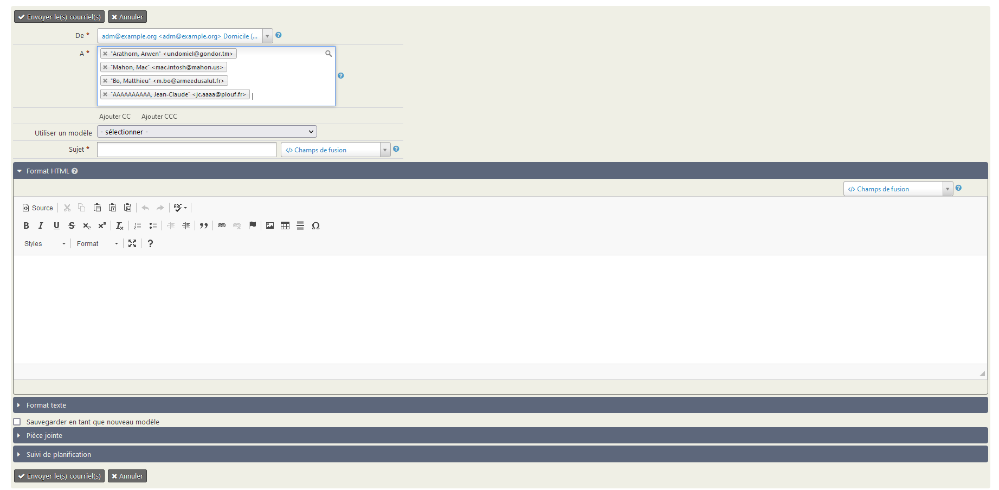
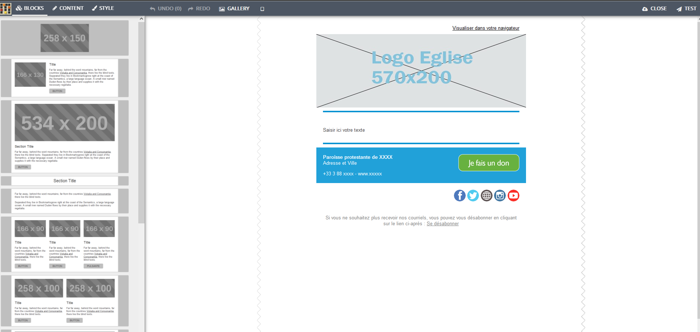

<!-- D10 C5.81 OK, Peter le 26.04.2025 -->

# Envoyer un courriel

CiviParoisse propose deux formes de courriels, l'une qui ressemble à ce que vous connaissez dans votre logiciel de courriel habituel, l'autre qui permet des présentations bien plus élaborées, tout en étant relativement simple à mettre en oeuvre. Cette deuxième solution est recommandée pour vos lettres électroniques, la première étant plutôt pour des courriels simples n'ayant pas besoin d'une grande esthétique.

!!! warning "Attention"
    Une autre différence importante est le nombre de destinataires.  
    Pour un **envoi immédiat**, il est nécessaire d'avoir moins de 50 destinataires.  
    Un **envoi massif** est possible pour tout nombre de destinataires, et obligatoire au-delà de 50 destinataires. Il est également possible d'en planifier l'envoi. Cela vous évitera d'être blacklistés, c'est à dire considéré comme spammeurs, ce qui aurait pour effet assez rapidement que soit vos courriels soient considérés comme "indésirables" (spam) ou pire n'arrivent pas du tout.  
    CiviParoisse n'envoie pas les messages de la même façon dans les deux cas.

Pour envoyer un courriel, vous pouvez partir d'une liste de contacts obtenue grâce à une recherche. Dans ce cas sélectionnez les contacts voulus puis cliquez sur `Actions` et choisissez `Courriel - envoi immédiat` ou `Courriel - planifier/envoyer un envoi massif`, selon le nombre de destinataires.

Mais vous pouvez aussi procéder des deux façons détaillées ci-après.

## Courriel classique ("Courriel - envoi immédiat")

Pour par exemple inviter les conseillers presbytéraux à la prochaine réunion, le contenu sera plus important que le contenant et aussi par souci écologique (les illustrations ont un coût en CO2), vous opterez sans doute pour le courriel classique qui permet déjà d'appliquer du gras, de l'italique, de placer un tableau, une image, d'ajouter des pièces jointes, etc.

* Pour y accéder, recherchez le ou les destinataires concernés, en utilisant les outils de recherche ([cliquez ici pour en savoir plus](faire_des_recherches_sur_les_contacts.md)). Après les avoir sélectionnés, cliquez sur `Courriel - envoi immédiat`.

* Dans la nouvelle fenêtre, choisissez l'adresse mail d'expédition si nécessaire dans le champ `De`. Supprimez ou rajoutez des adresses mails dans le champ `A`. Puis indiquez l'objet du mail dans le champ `Sujet`.

!!! warning "Attention"
    Il est indispensable de **choisir l'adresse de la paroisse comme adresse d'expédition** (le champ `De` tout en haut du mail que vous êtes en train de créer).  
    Ne choisissez jamais votre propre adresse mail : pour des raisons de sécurité, ces mails ne sont pas envoyés.

* Ecrivez votre courriel dans la partie `Format HTML`, rajoutez si besoin des pièces jointes dans la partie `Pièce jointe`, et cliquez sur `Envoyer les courriels`. Votre courrier sera alors envoyé immédiatement.

* Vous avez également la possibilité de rajouter des destinataires en copie en cliquant sur le bouton `Ajouter CC`, ou en copie cachée en cliquant sur le bouton `Ajouter CCC`.

<!--* Si vous pensez envoyer régulièrement le même courriel, vous pouvez créer un modèle, en cliquant sur `Sauvegarder en tant que nouveau modèle` et en lui donnant un titre. Vous pourrez ensuite réutiliser ce modèle en le sélectionnant dans le champ `Utiliser un modèle`.-->

!!! note "Astuce"
    CiviParoisse permet de faire du publipostage, vous pouvez donc ajouter par exemple les champs "Formule de salutation par courriel" suivi du champ "nom affiché" pour obtenir pour chaque destinataire quelque chose du type `Bien cher M. DUPONT Martin,`. Pour cela, utilisez les `champs de fusion` lors de la création du courriel.

## Mailing ("Courriel - envoi massif")

Si votre paroisse diffuse une lettre électronique d'information en complément du bulletin paroissial, vous voudrez sans doute que l'oeil du futur lecteur soit attiré par une présentation plus recherchée. Là encore, CiviParoisse vous permet de le faire.

Pour y accéder, cliquez sur `Mailings` et choisissez en haut de la liste `Nouveau mailing`. Vous pouvez également y accéder via le bouton `Action` dans les écrans de recherche, et en choisissant `Courriel - planifier/envoyer un mailing`.

### Première partie : le mailing

* Indiquez un nom du mailing. Ce nom se retrouvera, une fois le courriel envoyé, dans l'onglet `Activités` de chaque destinataire. Prenez par conséquent un nom suffisamment explicite pour qu'il vous parle encore des mois plus tard.

* Le champ `De` comporte en principe l'adresse courriel de votre paroisse. Si ce n'est pas le cas, choisissez bien l'adresse de votre paroisse.

* Dans `Destinataires` vous allez pouvoir choisir un groupe simplement en commençant à taper son nom. Si vous êtes préalablement passé par une recherche, le groupe est constitué automatiquement.  
Vous pouvez également rappeler le nom d'un ancien mailing, si vous souhaitez écrire à la même liste de personnes.

* Le `Sujet` correspond à ce qui est parfois "Objet" du courriel dans certains logiciels. C'est l'intitulé du courriel tel qu'il s'affichera chez vos destinataires.

<!-- * Choisissez le groupe *Désabonnement* dans la partie `Se désinscrire de la liste`. -->

* Cliquer sur `Suivant`.

### Deuxième partie : le design

* Choisissez le `modèle mail UEPAL`. Vous obtiendrez la fenêtre suivante :

* Pour créer votre courriel, vous pouvez simplement saisir le texte au centre du mail (là où il est indiqué `Saisir ici votre texte`).  
> Selon les besoins, vous pouvez modifier la mise en page en glissant un "bloc" (ou en cliquant sur le bouton "Add" qui apparait lorsque la souris se place sur un bloc) de la gauche vers la droite. Vous pourrez les réarranger à volonté. Vous pouvez ensuite personnaliser les différents blocs, placer du texte et des illustrations que vous utiliserez à chaque envoi et prévisualiser le résultat.  
A droite de chaque bloc se trouve une icône pour le dupliquer et une autre pour le supprimer si vous décidez d'une autre présentation.  
Si vous cliquez sur certains éléments, la partie de gauche change d'affichage pour vous permettre de personnaliser l'élément (par exemple pour indiquer la page Facebook de la paroisse).

* Une fois le courriel composé, cliquer sur :material-cloud-upload:`Fermer`.

* Au préalable, vous pourriez effectuer un test, en cliquant simplement sur :fontawesome-solid-paper-plane:`Tester`. Cela vous sera utile si vous avez mis en place une esthétique élaborée et que vous voudrez vérifier que le contenu est bien conforme à vous attentes, avant d'envoyer le courriel à l'ensemble des destinataires.

* Cliquer sur `Suivant`.

### Troisième partie : les options et l'envoi

* Planifiez l'envoi, soit immédiat (`Envoyer immédiatement`), soit à une date/heure future (`Send on...`).

* Pour ajouter des pièces jointes, cliquez sur `Advanced Mailing Options`. Rajoutez les fichiers en suivant les instructions à l'écran.

* Lorsque votre mailing est totalement préparé, cliquez sur `Submit Mailing`.

!!! info "Délais d'envoi de votre mailing"
    L'envoi de votre mailing commencera quelques minutes après avoir validé l'envoi. Selon le nombre de destinataires, la distribution sera étalée sur plusieurs dizaines de minutes. Ceci contribue à éviter que vos communications soient considérées comme des spams.
