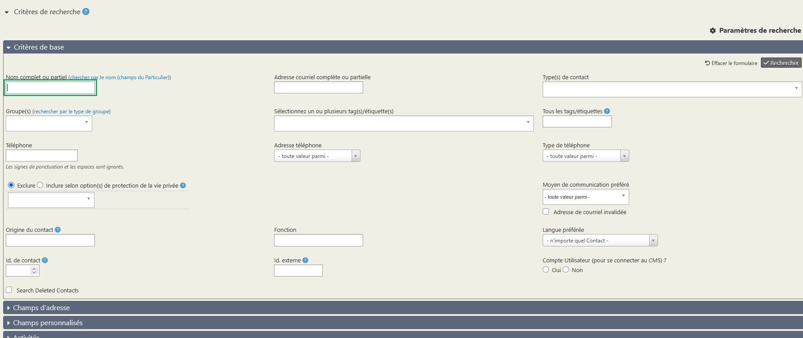

<!-- D10 C5.81 OK, Peter le 26.04.2025 -->

# Faire des recherches sur les contacts

## La recherche rapide

La recherche rapide est celle accessible via **l'icône de loupe** :fontawesome-solid-magnifying-glass:, tout à gauche du menu de CiviParoisse.
Par ce biais vous pouvez rapidement retrouver un contact si vous connaissez par exemple son nom, ou son numéro de téléphone.

> :material-lightbulb-on: L'ensemble des moyens de rechercher un contact permet l'utilisation du caractère générique **%**. Ainsi, rechercher *Mich%* vous donnera tous les "Michel", mais aussi les "Michelle" et les "Michaël".

## La recherche simple des contacts

Vous accédez à la recherche simple en cliquant sur :material-magnify:`Rechercher` puis `Rechercher des contacts`.

Bien que considérée comme simple, elle vous permet de filtrer par exemple les résultats par **type de contact** (:fontawesome-solid-user: individu, :fontawesome-solid-house-chimney: foyer ou :fontawesome-solid-building: organisation), par :fontawesome-solid-users: **groupe** ou encore les contacts ayant une :fontawesome-solid-tags: **étiquette** précise.

!!! note "Astuce"
    Dans la liste des résultats, laissez votre souris sur l'icône de la fiche (que ce soit un individu, un foyer ou une organisation) et une fenêtre apparait affichant un résumé de la fiche.

## La recherche avancée

Vous accédez à la recherche avancée en cliquant sur `Rechercher` puis `Recherche avancée`.

Cette recherche est très puissante et vous donne accès à toutes les données de CiviParoisse.

N'hésitez pas à explorer les différentes catégories.  
Elle vous permet par exemple d'indiquer plusieurs critères que vous combinez en cochant "Et" ou "Ou".

Par cette recherche vous avez plusieurs possibilités, la recherche par quartier par exemple. De même vous pourriez chercher toutes les personnes sachant jouer du piano.

> Si en septembre vous voulez contacter tous les jeunes de 11 ans pour les inviter au catéchisme, il suffit de vous rendre dans `Données démographiques`, d'indiquer en âge minimal et maximal "11" et vous aurez la liste des jeunes concernés. De façon semblable pour lister tous les plus de 65 ans pour la fête des Aînés.

Il est également possible d'écrire aux parents des jeunes ainsi sélectionnés. Pour cela, saisissez d'abord les critères pour sélectionner les jeunes (comme ci-dessus par exemple), puis en haut à droite de l'écran, dans les `Paramètres de recherche`, choisissez le type des résultats `Contacts liés`. Sélectionnez ensuite le type de relation `Parents de`, et cliquez sur `Rechercher`.

Notez qu'à tout moment vous pouvez modifier vos critères de recherche en cliquant sur `Modifier les critères de recherche`, sans avoir besoin de tout paramétrer à nouveau.

!!! note "Astuce"
    CiviParoisse étant utilisé dans votre navigateur préféré, faites un clic droit sur un des noms de la liste de résultat et choisissez `Ouvrir dans un nouvel onglet` pour ouvrir la fiche de contact dans un nouvel onglet, vous permettant de revenir aisément à votre liste ensuite.

## Utiliser les recherches pour mener des actions

Admettons que vous avez recherché tous les jeunes de 11 à 13 ans, et que vous souhaitez créer un groupe "Liste de diffusion" pour communiquer régulièrement avec eux, il vous suffit, une fois la liste des contacts affichée, de cliquer sur `Sélectionner :` et cocher `Tous (x trouvés)`. Cliquez ensuite sur `Actions` puis sur `Groupe - créer un groupe dynamique` pour créer votre liste de diffusion.

> Prenons un autre exemple, vous avez un groupe constitué des paroissiens qui ont fait un don à la paroisse l'année précédente à qui vous voulez envoyer un mot de remerciement.  
Pour envoyer des courriers à ces personnes, il vous suffit de faire une recherche en utilisant la recherche simple, et en recherchant le groupe en question.  
Une fois la liste affichée, sélectionnez tous les contacts comme vous avez appris à le faire, puis cliquez sur `Actions` et choisissez en fin de liste `Etiquettes pour la poste - imprimer`.  
Dans la fenêtre qui s'affiche, choisissez dans le menu `Sélectionner un format d'étiquette` le format des étiquettes dont dispose la paroisse, puis cliquez sur `Imprimer des étiquettes pour la Poste`. Un PDF est généré avec les étiquettes des différents foyers, il ne reste plus qu'à l'imprimer sur des planches d'étiquettes, et à envoyer votre courrier.

Le menu `Actions` propose également, selon le contexte, les possibilités suivantes :

* Afficher les contacts sur une carte
* Ajouter des relations aux contacts
* Supprimer les contacts (à manier évidemment avec précaution !)
* Ajouter une information sur une interaction avec les contacts (activités)
* Envoyer des courriels [(en savoir plus)](envoyer_un_courriel.md)
* Fusionner des doublons
* Ajouter ou enlever les contacts d'un groupe
* Inscrire les contacts à un événement
* Exporter les informations dans une feuille Excel
