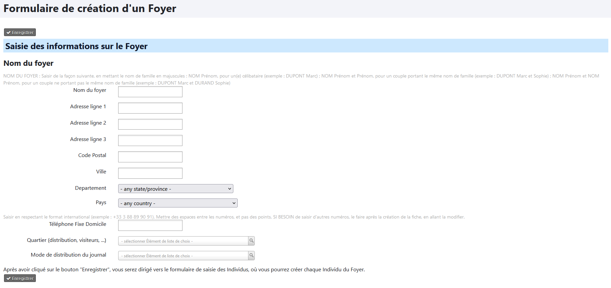
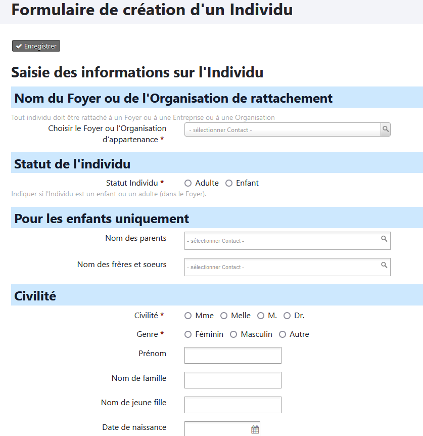

<!-- D10 C5.81 OK, Peter le 21.04.2025 -->

# Gérer les fiches avec les contacts

## :fontawesome-solid-house-chimney: Enregistrer un nouveau Foyer

!!! warning "Attention"
    N'utilisez pas le menu `Contact` -> `Nouveau foyer` mais suivez la procédure ci-dessous. Elle utilise un formulaire spécialement élaboré pour les paroisses.

Pour créer un nouveau "foyer" vous devez passer par la page d'accueil (voir [La page d'accueil](introduction.md#la-page-daccueil)) et cliquez sur l'icône "Nouveau Foyer".

Vous obtiendrez la fenêtre suivante :

Merci de respecter les règles suivantes pour maintenir la cohérence des données au sein de votre base de données :

:material-human-male-female-child: **Nom du Foyer** : saisir le nom de famille en **majuscules**, en respectant les règles suivantes :

* *NOM Prénom* pour un(e) célibataire (ex. : *DUPONT Marc*)
* *NOM Prénom et Prénom* pour un couple portant le même nom de famille (ex. *DUPONT Marc et Cécile*)
* *NOM Prénom et NOM Prénom* pour un couple ne portant pas le même nom de famille (ex. *DUPONT Marc et DURAND Cécile*)

:fontawesome-solid-map-location-dot: **Adresse** : la renseigner de façon aussi précise que possible.  

:fontawesome-solid-phone: **Numéro(s) de téléphone fixe de la maison** : seul le téléphone fixe est saisi dans la fiche Foyer, les numéros de portables sont saisis sur les fiches Individu respectives.  
Le(s) saisir en respectant le format international (ex. +33 3 88 89 90 91).  
Mettre des espaces entre les numéros et non des points.

:fontawesome-solid-tree-city: **Quartier** :  secteur géographique utilisé pour la distribution de journaux paroissiaux, du Nouveau Messager, de courriers, etc...  
Il est possible de gérer les noms des quartiers ([en savoir plus](gestion_base_donnees.md#modifier-la-liste-des-quartiers))

## :fontawesome-solid-user: Enregistrer un nouvel individu

!!! warning "Attention"
    N'utilisez pas le menu `Contact` -> `Nouveau particulier` mais suivez la procédure ci-dessous. Elle utilise un formulaire spécialement élaboré pour les paroisses.

Pour créer un nouveau "individu" vous devez passer par la page d'accueil (voir [La page d'accueil](introduction.md#la-page-daccueil)) et cliquez sur l'icône "Nouveau Individu / Particulier".

Contrairement à la fiche foyer, nous avons ici un large panel d'informations que nous pouvons enregistrer.

Le premier élément important est de **relier l'individu à une fiche "foyer"** en choisissant le foyer d'appartenance.

!!! success "Création de la fiche d'un enfant"
    Si vous ajoutez un enfant, en choisissant ses parents et ses frères et soeurs, les relations seront automatiquement établies.

Il est important de respecter quelques règles :

:material-human-male-female-child: **Nom de famille** : le saisir **en majuscules**. Si besoin, saisir le nom de naissance dans la case `Nom de naissance` (en bas à gauche, dans la partie `Etat Civil`).

:fontawesome-solid-map-location-dot: **Adresse** : elle est automatiquement reprise de l'adresse du foyer. Si ce n'est pas le cas, il faut rattacher l’adresse à celle du foyer. Pour cela, tapez dans le champ `Choisir le foyer d'appartenance` les premières lettres du nom du foyer, puis sélectionnez le bon foyer.

:octicons-mail-24: **Courriel** : renseignez le ou les adresses mail.

:fontawesome-solid-phone: **Téléphone** : renseignez le numéro de portable, personnel voire professionnel, en respectant le format international (ex. +33 6 00 11 22 33), avec des espaces entre les numéros et nom des points.

:fontawesome-solid-church: Complétez les données **Religion** (dates de baptême, de confirmation de mariage...) et indiquez dans quel paroisse cela a eu lieu.  
Si vous ne trouvez pas le nom de la paroisse, choisissez `Autres`. Puis après la création de la fiche, rajoutez une `Note` pour indiquer le nom exact.

:material-calendar-month-outline: Complétez ensuite l'**état civil** avec les éléments dont vous disposez.

:material-playlist-music: Ne négligez pas la rubrique **Compétences** lorsqu'elles sont connues, pour inviter par exemple la personne par la suite à venir renforcer la chorale ou un groupe de musique.

:fontawesome-solid-photo-film: Une fois la fiche créée, ajoutez une **photo** de la personne si vous en avez une (format conseillé : 250 x 370 pixels, en 72 dpi)

N'hésitez pas à consulter les recommandations sur le **lien avec la paroisse** si vous avez un doute sur le lien à établir. [(En savoir plus)](relations.md)

> Les éléments sur la Sécurité sociale, le Guso, ou pour savoir si la personne est fonctionnaire, ne sont réellement utiles que pour la fiche d'un musicien rémunéré par la paroisse.
