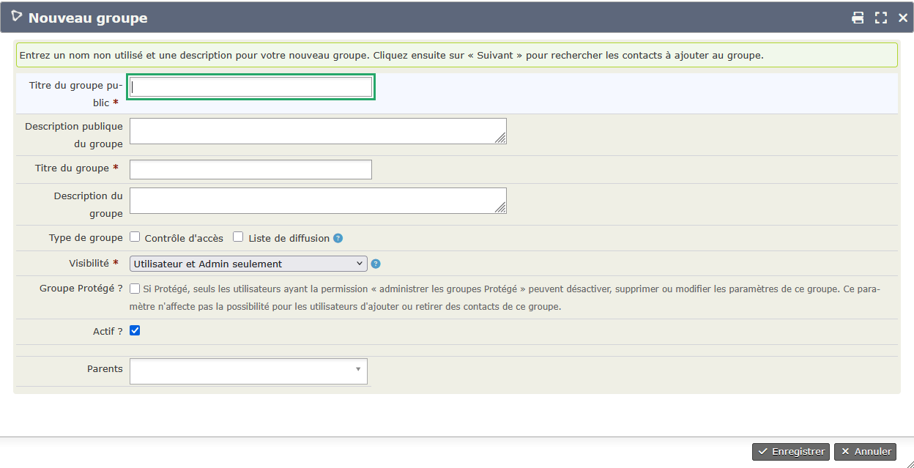

<!-- D10 C5.81 OK, Peter le 26.04.2025 -->

# Gérer les groupes

Les groupes sont une autre façon d'établir un lien entre des personnes, de dire qu'elles partagent quelque chose, une activité par exemple.  
Vous pouvez ainsi créer un groupe qui recense tous les membres de la chorale, un autre pour les catéchètes, ou encore pour les participants au groupe biblique.

## Les deux sortes de groupes

* Un **groupe statique** est composé des contacts que vous rajouterez manuellement.

* Dans un **groupe dynamique**, vous n'ajoutez pas les personnes manuellement, mais elles se retrouvent automatiquement dans ce groupe de par leur âge, une relation ou tout autre élément que vous aurez défini au préalable.

## Créer un groupe statique

Pour créer un groupe statique, il vous suffit d'aller dans le menu `Contacts`, puis `Gestion des groupes`.

En cliquant sur `Ajouter un groupe` vous obtenez la fenêtre suivante :

Il est recommandé d'utiliser un nom explicite et d'ajouter une description pour que la personne qui n'identifie pas le groupe par son nom puisse retrouver le bon groupe par un texte plus long et détaillé.

!!! warning "Attention"
    Ne cochez pas `contrôle d'accès`.  
    En revanche, si vous envisagez d'envoyer des courriels aux membres du groupe, il sera indispensable de cocher `Liste de diffusion`.  
    Si vous voulez juste visualiser les membres sans leur écrire, ne cocher aucun des deux.

Vous pouvez même, comme vous l'avez sans doute remarqué, créer des sous-groupes en indiquant lors de la création du sous-groupe quel est son groupe parent.

Vous ajoutez ensuite des contacts au groupe depuis la fiche de chaque contact, onglet `Groupes`. Vous pouvez également faire des rajouts en nombre, à partir d'un écran `Recherches`.

C'est depuis le menu `Gérer les groupes` que vous pouvez visualiser les membres en cliquant sur `Contacts` à la fin de la ligne du groupe.

## Créer un groupe dynamique

Il s'agit tout d'abord d'effectuer une recherche (voir [Faire des recherches](faire_des_recherches_sur_les_contacts.md) pour des conseils pour vous aider à retrouver les fiches selon divers critères).

Une fois la liste des contacts obtenue, sélectionnez tout d'abord l'ensemble des contacts en cliquant sur `Sélection des enregistrements : Les x trouvés`. Puis cliquez sur `Actions` et choisissez `Groupe - créer un groupe dynamique`, donnez lui un nom, une description et cochez ou non `Liste de diffusion`
Désormais, dès qu'un contact rempli les critères de la recherche il est automatiquement ajouté au groupe dynamique, et inversement, si pour un contact du groupe un critère n'est plus rempli, il ne sera plus membre du groupe dynamique.

!!! danger "Ne pas supprimer un contact manuellement "
    Pour assurer le bon fonctionnement des groupes dynamiques, il est important de ne **jamais supprimer manuellement** un contact présent dans un Groupe dynamique. Vous risquerez de perturber gravement les prochaines mises à jour du groupe.

## Inscrire dans un groupe

> Partie en cours d'écriture

## Enlever d'un groupe

> Partie en cours d'écriture

!!! warning "N'utilisez pas la suppression"
    Afin de conserver l'historique des participations aux différents groupes de la paroisse, n'utilisez jamais la touche Supprimer.
